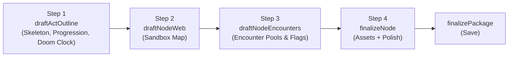

<!-- KEEP-IN-SYNC: Update this file when modifying planningChatAgent.ts or planningTools.ts -->

# Planning Agent Reference

Collaborative visual novel co-author. Works with users through conversation to design an interactive, sandbox-style visual novel with **Director/Storyteller dual-agent architecture**. Produces encounter-based story backbones with progression tracking, doom clocks, and character arcs.

> See also: [../CLAUDE.md](../CLAUDE.md) for VNPackage/VNFrame schemas | [storyteller-agent.md](storyteller-agent.md) for gameplay agent

---

## Architecture: 4-Step Generation Pipeline

Creating a rich sandbox in a single shot is impossible for an LLM. The Planner enforces a strict pipeline that builds the story incrementally:



| Step | Tool | What it does |
|------|------|-------------|
| **1. Skeleton** | `draftActOutline` | Proposes the Act's objective, scenario context, inevitable events, progression tracker, doom clock, and placeholder locations |
| **2. Sandbox Map** | `draftNodeWeb` | Wires Locations into a spatial sandbox with `connections`, ambient details, characters |
| **3. Encounter Pools** | `draftNodeEncounters` | Populates each Location with unordered encounters — the Director selects which to activate based on flags, progression, and pacing |
| **4. Assets** | `finalizeNode` | Generates background image + ambient music for each Location |

### Why This Order Matters
- **Step 1 before 2:** Can't wire connections between Locations that don't exist yet
- **Step 2 before 3:** Encounters need to know the Location's role, characters, and connections
- **Step 3 before 4:** Asset prompts should reflect the encounter content at each location
- **Constraint:** Encounters MUST assign specific `potentialFlags` and `givesProgression` values for the Director to track progression

---

## Director/Storyteller Architecture

The Planning Agent designs story backbones for a two-agent runtime system:

- **Director** (hidden LLM, inside `plotStateTool`): Reads full story state, selects encounters from the pool, manages doom clock / NPC arcs / complications, produces a free-form **Direction Pack** for the Storyteller.
- **Storyteller** (visible agent): Renders the current beat into VN frames. Never knows the Director exists.

**Key implication for planning:** Design encounters as self-contained units that work in any order. The Director dynamically selects them — the author can't predict the exact sequence.

---

## Agent Configuration

| Property | Value |
|----------|-------|
| **File** | `server/vn/agents/planningChatAgent.ts` |
| **Type** | `ToolLoopAgent` (AI SDK) |
| **Model** | Google Gemini via `getModel('planning')` |
| **Stop Condition** | `hasToolCall('finalizePackage')` |
| **UI Message Type** | `PlanningUIMessage = InferAgentUIMessage<typeof agent>` |

---

## Tools (8)

All tools created by `createPlanningTools(session: PlanSession)` in `server/vn/tools/planningTools.ts`.

### `proposeStoryPremise`

Sets the narrative anchor. Called once early in planning.

**Input:**
```typescript
{
  title: string
  artStyle: string                    // "cel-shaded anime, dark and moody"
  language: string                    // BCP-47, default 'en'
  globalContext: { setting, tone, overarchingTruths[] }
  premise: string                     // 1-2 sentence story premise
  themes: string[]                    // Core themes
  globalMaterials: string[]           // Reusable narrative anchors (motifs, items, symbols)
  globalWorldInfo?: WorldInfo[]       // Keyword-triggered lore
  possibleEndings: string[]           // 2-3 ending categories
}
```

**Returns:** `{ ok: true, title: string }`

---

### `proposeCharacter`

Creates a character with portrait generation and optional personal arc.

**Input:**
```typescript
{
  id: string                          // Lowercase slug = asset key, e.g. "lin_mei"
  name: string
  role: 'protagonist' | 'ally' | 'antagonist' | 'npc'
  description: string                 // Personality, backstory, PbtA stat modifiers
  imagePrompt: string                 // Visual generation prompt
  personalArc?: {
    want: string                      // What the character consciously desires
    need: string                      // What the character actually needs to grow
    arcEncounters: [{                 // Character-specific encounters injected by the Director
      id, title, description, type, pacing,
      arcPhase: 'introduction' | 'development' | 'crisis' | 'resolution',
      potentialFlags?, givesProgression?
    }]
  }
}
```

**Returns:** `{ ok: true, id, name, imageUrl }`

**Side effects:** Generates PNG portrait

---

### `draftActOutline` — Pipeline Step 1

Proposes the Act skeleton with progression and doom clock.

**Input:**
```typescript
{
  id: string
  title: string
  objective: string
  scenarioContext: string             // Hidden truth for DM
  narrativeGuidelines: string        // Stylistic rules
  intendedLocations: string[]        // Location slugs
  inevitableEvents?: [{
    id, title, triggerCondition, description,
    forcesClimax: boolean,
    conditionalBranches?: [{ condition, effect }]
  }]
  scenarioWorldInfo?: WorldInfo[]
  globalProgression?: {
    requiredValue: number             // Progress needed to complete act
    trackerLabel: string              // e.g. "Clues Uncovered"
  }
  opposingForce?: {
    trackerLabel: string              // e.g. "Time Paradox Alert"
    requiredValue: number             // Max before forced climax
    escalationEvents: [{ threshold, description }]
  }
}
```

**Returns:** `{ ok: true, id, title }`

---

### `draftNodeWeb` — Pipeline Step 2

Wires the Locations into a spatial sandbox map.

**Input:**
```typescript
{
  actId: string
  locations: [{
    id: string                        // Must match intendedLocations
    title: string
    location: string                  // Asset key for background (= location id)
    requiredCharacters: string[]
    ambientDetail: string
    mood: string                      // Asset key for music
    callbacks?: string[]
    connections: string[]             // Location IDs player can travel to
  }]
}
```

**Returns:** `{ ok: true, updatedLocations: number }`

---

### `draftNodeEncounters` — Pipeline Step 3

Populates a single Location with an unordered encounter pool.

**Input:**
```typescript
{
  actId: string
  nodeId: string                      // Location ID
  encounters: [{
    id: string                        // e.g. "enc_locked_drawer"
    title: string
    description: string               // DM instructions for narrating
    type: 'discovery' | 'npc_interaction' | 'combat' | 'puzzle' | 'atmospheric'
    pacing: {
      expectedFrames: number
      focus: 'dialogue_and_worldbuilding' | 'standard' | 'tension_and_action'
    }
    prerequisites?: string[]          // Flags required
    excludeIfFlags?: string[]         // Skip if these flags set
    requiredCharacters?: string[]     // NPCs needed
    givesProgression?: number         // Increment act progression
    potentialFlags?: string[]         // Flags player can earn
    findings?: string[]               // Clues discovered
    interactables?: string[]          // Items discoverable
    priority?: 'low' | 'normal' | 'high' | 'urgent'
    repeatable?: boolean
  }]
}
```

**Returns:** `{ ok: true, updated: string, encounterCount: number }`

**Key design:** Encounters are unordered — the Director selects dynamically. Design them to work in any sequence. Use `prerequisites` and `excludeIfFlags` for soft ordering.

---

### `finalizeNode` — Pipeline Step 4

Generates assets for a completed Location.

**Input:**
```typescript
{
  actId: string
  nodeId: string
  backgroundPrompt: string
  musicPrompts: [{ text, weight }]
}
```

**Returns:** `{ ok: true, id, title, backgroundUrl, musicUrl }`

---

### `updateElement`

Modifies any draft element after initial proposal.

**Input:**
```typescript
{
  type: 'premise' | 'character' | 'act' | 'node'
  actId?: string
  id?: string
  changes: Record<string, unknown>
  regenerateImage?: boolean
}
```

**Returns:** `{ ok: true, updated: type, id? }`

---

### `finalizePackage`

Validates and saves the complete VN package. Triggers agent loop stop.

**Input:**
```typescript
{ title: string }
```

**Returns:** `{ ok: true, packageId, title, totalNodes }`

**Side Effects:**
1. Validates: premise exists, >= 1 act with locations + encounters
2. Assembles `VNPackage` with Acts -> Locations -> Encounters
3. Includes `personalArc`, `globalProgression`, `opposingForce`
4. Validates against `VNPackageSchema`
5. Saves to disk + SQLite

---

## Encounter Design Principles

- **No dead ends**: Every encounter should give progression, set a flag, or provide narrative value
- **Interconnected flags**: Flag chains across locations — finding something in A unlocks encounters in B
- **Varied pacing**: Mix dialogue_and_worldbuilding with tension_and_action at each location
- **NPC encounters**: Use `requiredCharacters` to tie encounters to specific NPCs
- **Repeatable encounters**: Mark atmospheric/ambient as `repeatable: true` for Director filler
- **Progression balance**: Distribute `givesProgression` across encounters so the act's `requiredValue` is achievable through multiple paths

---

## State Lifecycle

```
getOrCreatePlanSession(sessionId, locale)
  -> Creates PlanSession with UUID packageId
  -> Initializes empty draft { characters:[], acts:[] }

[Agent iterates pipeline per Act:]
  -> draftActOutline -> draftNodeWeb -> draftNodeEncounters -> finalizeNode
  -> Each tool mutates session.draft in-memory

finalizePackage()
  -> Assembles VNPackage from draft (Acts -> Locations -> Encounters)
  -> Includes personalArcs, globalProgression, opposingForce
  -> Persists to DB + filesystem
  -> Session can be cleared via clearPlanSession()
```

**Note:** PlanSession is in-memory only (Map). Not persisted to DB. Lost on server restart.
