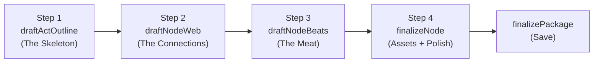

<!-- KEEP-IN-SYNC: Update this file when modifying planningChatAgent.ts or planningTools.ts -->

# Planning Agent Reference

Collaborative visual novel co-author. Works with users through conversation to design a complete **Act → Node → Beat** story structure with generated assets, networked branching, and fail-forward routing.

> See also: [../CLAUDE.md](../CLAUDE.md) for VNPackage/VNFrame schemas | [storyteller-agent.md](storyteller-agent.md) for gameplay agent

---

## Architecture: 4-Step Generation Pipeline

Creating a deeply branching network of Nodes in a single shot is impossible for an LLM. The Planner enforces a strict pipeline that builds the story incrementally:



| Step | Tool | What it does |
|------|------|-------------|
| **1. Skeleton** | `draftActOutline` | Proposes the Act's objective and registers empty Node slugs |
| **2. Connections** | `draftNodeWeb` | Wires Nodes into a directed graph with `exitConditions` — must include fail-forward routes |
| **3. Meat** | `draftNodeBeats` | Populates each Node with ordered narrative beats, findings, interactables, pacing |
| **4. Assets** | `finalizeNode` | Generates background image + ambient music for each Node |

### Why This Order Matters
- **Step 1 before 2:** Can't wire connections between Nodes that don't exist yet
- **Step 2 before 3:** Beats need to know the Node's role in the network (is it a consequence? a climax?)
- **Step 3 before 4:** Asset prompts should reflect the narrative content of the Node
- **Constraint:** `draftNodeWeb` MUST route failures to Consequence Nodes, never to "Game Over"

---

## Agent Configuration

| Property | Value |
|----------|-------|
| **File** | `server/vn/agents/planningChatAgent.ts` |
| **Type** | `ToolLoopAgent` (AI SDK) |
| **Model** | Google Gemini via `getGoogleModel('planning')` |
| **Stop Condition** | `hasToolCall('finalizePackage')` |
| **UI Message Type** | `PlanningUIMessage = InferAgentUIMessage<typeof agent>` |

---

## System Prompt Philosophy

### Role
```
You are a collaborative visual novel co-author and expert Narrative Architect.
Design an interactive, node-based visual novel with networked branching.
```

### Language Enforcement
```
LANGUAGE: "${language}" (BCP-47). Pre-selected, do NOT ask.
ALL generated content MUST be in this language only. No mixing.
```

### Structural Design (TRPG & AVG Fusion)
- **Node-Based Design:** Nodes represent locations/events with Three Clue Rule (≥3 clues pointing to next node(s))
- **Onion Layer Branching:** Tactical branches for how players solve the mystery
- **Broad Endings:** 3-4 ending categories, not a single scripted climax
- **Networked Routing:** All Nodes within an Act connect via `exitConditions` — failure routes to Consequence Nodes

### Prose Voice Rules
- **Show, don't tell** — physical reactions/environment, never state emotions directly
- **Specific vocabulary** — ban clichés, use muscular verbs and concrete nouns
- **Sensory grounding** — anchor descriptions in at least two senses
- **PbtA stats** — assign 2d6 modifiers (e.g., `Charm +2`, `Logic -1`) in character descriptions for DM skill checks

### Workflow Sequence
```
0. RESEARCH FIRST — Use googleSearch before proposing content
1. Ask about genre, setting, language
2. proposeStoryPremise (with broad endings + globalMaterials)
3. proposeCharacter (one at a time, lowercase slug IDs)
4. draftActOutline → draftNodeWeb → draftNodeBeats → finalizeNode (per Act)
5. updateElement for tweaks
6. finalizePackage (only when user confirms)
```

### Tone
Conversational. Avoid walls of text.

---

## Tools (8)

All tools created by `createPlanningTools(session: PlanSession)` in `server/vn/tools/planningTools.ts`.

### `proposeStoryPremise`

Sets the narrative anchor. Called once early in planning.

**Input:**
```typescript
{
  title: string
  artStyle: string                    // "cel-shaded anime, dark and moody"
  language: string                    // BCP-47, default 'en'
  setting: { world, era, tone }
  premise: string                     // 1-2 sentence story premise
  themes: string[]                    // Core themes
  globalMaterials: string[]           // Reusable narrative anchors (motifs, items, symbols)
  possibleEndings: string[]           // 2-3 ending categories
}
```

**Returns:** `{ ok: true, title: string }`

---

### `proposeCharacter`

Creates a character with portrait generation. Called once per character.

**Input:**
```typescript
{
  id: string                          // Lowercase slug = asset key, e.g. "kira_voss"
  name: string
  role: 'protagonist' | 'ally' | 'antagonist' | 'npc'
  description: string                 // Personality, backstory, PbtA stat modifiers
  imagePrompt: string                 // Visual generation prompt
}
```

**Returns:** `{ ok: true, id, name, imageUrl }`

**Side effects:** Generates PNG portrait → `/public/generated/{packageId}/{id}.png`

---

### `draftActOutline` — Pipeline Step 1

Proposes the Act skeleton: objective + placeholder Node slugs.

**Input:**
```typescript
{
  id: string                          // e.g. "act_1_sern"
  title: string                       // "Infiltrate SERN"
  objective: string                   // "Find the IBN-5100"
  intendedNodes: string[]             // ["node_loading_dock", "node_server_room", ...]
}
```

**Returns:** `{ ok: true, id, title, nodeCount }`

**Effect:** Creates Act + initializes empty Node objects for every slug.

---

### `draftNodeWeb` — Pipeline Step 2

Wires the Nodes into a directed graph with exit conditions.

**Input:**
```typescript
{
  actId: string
  nodes: [{
    id: string                        // Must match intendedNodes from Step 1
    title: string
    location: string                  // Asset key for background (= node id)
    requiredCharacters: string[]      // Character IDs that appear
    mood: string                      // Asset key for music
    callbacks?: string[]              // Instructions for DM to re-use globalMaterials
    exitConditions: [{
      condition: string               // "Player sneaks past guards"
      nextNodeId?: string             // Target Node. Omit only for absolute final Act ending.
    }]                                // Min 1 exit condition per node
  }]
}
```

**Returns:** `{ ok: true, actId, nodeCount }`

> [!IMPORTANT]
> **Fail-forward constraint:** Every `exitCondition` representing failure MUST route to a Consequence Node, not game-over. The system prompt instructs the LLM to reject dead-end topologies.

---

### `draftNodeBeats` — Pipeline Step 3

Populates a single Node with ordered narrative beats.

**Input:**
```typescript
{
  actId: string
  nodeId: string
  beats: [{
    description: string               // Core narrative action of this beat
    pacing: string                    // DM instructions: "5-8 frames of rapid dialogue"
    findings?: string[]               // Clues uncovered in this beat
    interactables?: string[]          // Discoverable items in this beat
    foreshadowing?: string            // Subtle hints for future beats
    objective?: string                // What player must accomplish
    nextBeatIfFailed?: string         // Early branch if player fails (fail-forward within Node)
  }]                                  // Min 1 beat
}
```

**Returns:** `{ ok: true, actId, nodeId, beatCount }`

**Key design:** Because the LLM isn't worrying about Act-level topology (that was Step 2), it can focus purely on Steins;Gate-style subjective pacing and dialogue.

---

### `finalizeNode` — Pipeline Step 4

Generates assets for a completed Node.

**Input:**
```typescript
{
  actId: string
  nodeId: string
  backgroundPrompt: string            // Visual prompt for background image
  musicPrompts: [{ text, weight }]    // Weighted prompts for ambient music
}
```

**Returns:** `{ ok: true, nodeId, backgroundUrl, musicUrl }`

**Side effects:**
- Generates background PNG → `/public/generated/{packageId}/{location}.png`
- Generates ambient music WAV → `/public/generated/{packageId}/{mood}.wav`

---

### `updateElement`

Modifies any draft element after initial proposal.

**Input:**
```typescript
{
  type: 'premise' | 'character' | 'act' | 'node'
  actId?: string                      // Required if updating a node
  id?: string                         // Required for character/node
  changes: Record<string, unknown>    // Fields to merge
  regenerateImage?: boolean           // Re-generate portrait if imagePrompt changed
}
```

**Returns:** `{ ok: true, updated: type, id? }`

---

### `finalizePackage`

Validates and saves the complete VN package. Triggers agent loop stop.

**Input:**
```typescript
{ title: string }                     // Confirmed story title
```

**Returns:** `{ ok: true, packageId, title, totalNodes }`

**Side Effects:**
1. Validates: premise exists, ≥1 act with nodes
2. Assembles `VNPackage` with Acts → Nodes → Beats hierarchy
3. Validates against `VNPackageSchema`
4. Saves to `/public/generated/{packageId}/story.json`
5. Inserts into `vnPackages` SQLite table

---

## Output Structure

### During Planning: `PlanSession.draft`

```typescript
PlanDraft {
  premise?: {
    title, artStyle, language,
    setting: { world, era, tone },
    premise, themes, globalMaterials, possibleEndings
  }
  characters: [{ id, name, role, description, imagePrompt, imageUrl? }]
  acts: [{
    id, title, objective,
    nodes: [{
      id, title, location, requiredCharacters, mood,
      callbacks?, beats?,
      exitConditions: [{ condition, nextNodeId? }],
      backgroundUrl?, musicUrl?
    }]
  }]
  referenceImages: [{ data, mimeType }]
}
```

### On Finalize: `VNPackage`

See [../CLAUDE.md](../CLAUDE.md) for full schema.

Key transformation: draft acts with nodes are assembled into `Act.nodes[]`, asset URLs collected into `AssetPack`, metadata (totalNodes, estimatedDuration, generationMs) computed.

---

## Example: Steins;Gate-style Act

```json
{
  "id": "act_1_sern",
  "title": "Infiltrate SERN",
  "objective": "Find the IBN-5100 hidden in the sub-basement.",
  "nodes": [
    {
      "id": "node_loading_dock",
      "title": "The Loading Dock",
      "exitConditions": [
        { "condition": "Player sneaks past the guards.", "nextNodeId": "node_server_room_b" },
        { "condition": "Player is spotted or fails stealth.", "nextNodeId": "node_interrogation" }
      ],
      "beats": [
        {
          "description": "Arrive at the dimly lit loading dock. Security patrols every 90 seconds.",
          "pacing": "2-3 atmospheric frames, then a tense decision point",
          "interactables": ["stack of shipping crates", "security camera feed"],
          "foreshadowing": "The crates are stamped with an unfamiliar SERN sub-division logo."
        }
      ]
    }
  ]
}
```

---

## State Lifecycle

```
getOrCreatePlanSession(sessionId, locale)
  → Creates PlanSession with UUID packageId
  → Initializes empty draft { characters:[], acts:[] }

[Agent iterates pipeline per Act:]
  → draftActOutline → draftNodeWeb → draftNodeBeats → finalizeNode
  → Each tool mutates session.draft in-memory

finalizePackage()
  → Assembles VNPackage from draft (Acts → Nodes → Beats)
  → Persists to DB + filesystem
  → Session can be cleared via clearPlanSession()
```

**Note:** PlanSession is in-memory only (Map). Not persisted to DB. Lost on server restart.

---

## Asset Generation

| Asset Type | Generator | Output | Path |
|-----------|-----------|--------|------|
| Character portrait | `generateCharacterImage()` | PNG (transparent BG) | `/generated/{packageId}/{charId}.png` |
| Node background | `generateSceneImage()` | PNG (16:9) | `/generated/{packageId}/{location}.png` |
| Ambient music | `generateAmbientMusic()` | WAV (PCM) | `/generated/{packageId}/{mood}.wav` |

Skipped when `session.bypassAssets = true` (for testing).

---

## API Route

**`POST /chat`** (`server/vn/routes/planChatRoute.ts`)

```typescript
// Request
{ messages: UIMessage[], sessionId: string, locale?: string }

// Response: SSE stream (Fastify hijack)
```

Flow:
1. `getOrCreatePlanSession(sessionId, locale)`
2. Extract reference images from latest user message → `session.draft.referenceImages`
3. Create agent via `createPlanningAgent(session)`
4. Stream response as SSE
