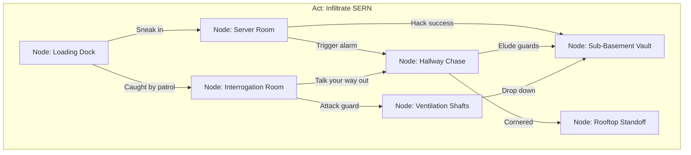
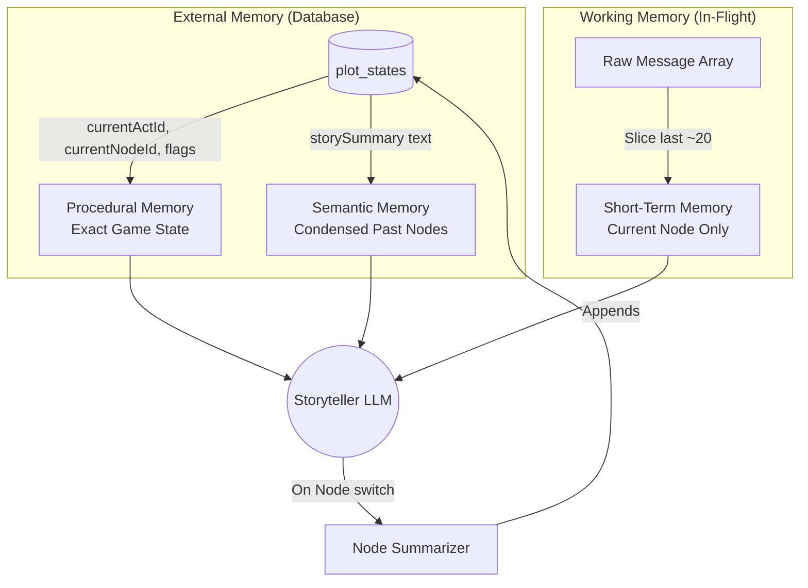

<!-- KEEP-IN-SYNC: Update this file when modifying storytellerChatAgent.ts or any gameplay tool -->

# Storyteller Agent Reference

Dungeon Master for visual novel gameplay. Generates narrative frames per turn based on a pre-built VNPackage, managing plot progression through a networked **Act → Node → Beat** hierarchy with fail-forward routing, combat, and player interactions.

> See also: [../CLAUDE.md](../CLAUDE.md) for VNPackage/VNFrame schemas | [planning-agent.md](planning-agent.md) for story design agent

---

## Architecture: Networked Act-Node-Beat Hierarchy

The narrative is structured as a directed graph that **prevents dead ends**. Failure is never game-over — it routes to Consequence Nodes.



### Core Concepts

| Concept | Definition |
|---------|-----------|
| **Act** | Overarching story phase with a core objective (e.g., "Infiltrate SERN"). Contains a network of Nodes. |
| **Node** | A key location, encounter, or moment (e.g., "The Server Room"). Contains ordered Beats and `exitConditions` that route to other Nodes. |
| **Beat** | Micro-pacing within a Node — a narrative moment, clue reveal, or dialogue. The DM advances through beats sequentially. |
| **Consequence Node** | A Node reached through failure. Never a dead end — always provides paths forward. |
| **exitConditions** | Conditions that trigger transition to another Node (success OR failure). Every exit routes to a valid Node, never to "Game Over". |

### Fail-Forward Routing

The DM **MUST** follow these rules:
1. **No game-over states.** A PbtA miss (≤6) or bad choice routes to a Consequence Node, not termination.
2. **All paths converge.** Even messy paths (chase → standoff) eventually give the player a chance to reach the Act's objective.
3. **Complications, not punishment.** Failed rolls introduce severe complications (captured, injured, betrayed) — but the story continues.

---

## Agent Configuration

| Property | Value |
|----------|-------|
| **File** | `server/vn/agents/storytellerChatAgent.ts` |
| **Type** | `ToolLoopAgent` (AI SDK) |
| **Model** | Google Gemini via `getGoogleModel('storyteller')` |
| **Stop Condition** | `hasToolCall('yieldToPlayer')` OR `hasToolCall('nodeCompleteTool')` |
| **UI Message Type** | `StorytellerUIMessage = InferAgentUIMessage<typeof agent>` |

---

## System Prompt Structure

Built by `buildDMSystemPrompt(vnPackage, sessionId)`.

### Context Injection
```
You are a visual novel storyteller DM for "${vnPackage.title}".
LANGUAGE: ${vnPackage.language ?? 'en'}
SETTING: ${vnPackage.setting.world}, ${vnPackage.setting.era}. Tone: ${vnPackage.setting.tone}.
ART STYLE: ${vnPackage.artStyle}
STORY PREMISE: ${vnPackage.plot.premise}
POSSIBLE ENDINGS: ${vnPackage.plot.possibleEndings.join(' | ')}
GLOBAL MATERIALS: ${vnPackage.plot.globalMaterials}
CHARACTERS: [list with asset keys]
AVAILABLE ASSETS: [backgrounds, characters, music]
```

### Language Enforcement
All generated text — dialogue, narration, character speech, skill check descriptions, choice text, item names, location names — MUST be in the story language.

### Prose Voice
1. **Subjectivity as Action:** The narrator's internal state (anxiety, hyper-fixation) IS the action — show it before reacting to plot.
2. **Sensory Anchoring First:** Ground in textures, temperature, smell before plot advancement.
3. **Deflation of Tension:** Interrupt stakes with extreme banality for dramatic contrast.
4. **Micro-Pacing:** Short 1-3 sentence bursts. In dramatic moments, single words via `narrations[]`.
5. **Dialogue Dissonance:** Non-sequiturs, trivialities during serious moments. Use `isNarrator: true` for protagonist reactions.
6. **Banned phrases:** "palpable tension", "sent shivers down", "a sense of", etc.

### DM Workflow (Per Turn)
```
1. Read State First: Always call plotStateTool() to get current Act, Node, Beat position.
   - Understand the current Act's OBJECTIVE
   - Know which Node you're in and its exit conditions
   - Read the current beat to narrate

2. Compose Frames: Use frameBuilderTool() for cohesive scene moments.
   - Open with the world, not the plot
   - Reveal at most ONE finding per turn when player action naturally uncovers it

3. PbtA 2d6 Mechanics:
   - Turn 1: Narrate tension → dice-roll frame → yieldToPlayer('dice-result')
   - Turn 2: Receive roll. 10+ = full success. 7-9 = mixed/complication. ≤6 = hard move.
   - ≤6 MUST route to a Consequence Node via nodeCompleteTool, never game-over.

4. Node Transitions:
   - When exitConditions are met → narrate the transition → nodeCompleteTool
   - On failure: route to the Consequence Node defined by exitConditions
   - On success: route to the next Node in the Act's network

5. Turn Endings — choose ONE yield mode:
   - yieldToPlayer('choice')     — genuine branching decision
   - yieldToPlayer('free-text')  — open-ended player action
   - yieldToPlayer('continue')   — pure narrative, player advances
   - yieldToPlayer('dice-result')— dice roll pending
   - yieldToPlayer('combat-result')— tactical combat pending
```

### Scene Unfolding
- **Iceberg principle**: Show 10%, imply 90%.
- **Graduated revelation**: Turn 1 = atmosphere + sensory anchor. Turn 2 = character reacts. Turn 3 = situation clarifies.
- **Never front-load**: No exposition dumps. Let it emerge through dialogue, objects, environment.

### Choice Quality
- **Choices are consequences**, not menus. Each changes the trajectory.
- **Phrase as impulses**: "Grab the lantern and run" not "Option A: Take lantern."
- **2-3 options max**.
- **When NOT to offer choices**: After revelations, during NPC monologues, when flow is natural → use `continue`.

### Frame Rhythm — Three-Gear Model
| Gear | When | Style |
|------|------|-------|
| **Slow** | Node openings, atmosphere | 1 frame, dense `narrations[]` |
| **Medium** | Dialogue, investigation | 1-2 frames, `conversation[]` back-and-forth |
| **Fast** | Crisis, combat, chase | 2-3 frames, short punchy, rapid cuts |

Shift gears within a turn. Give breath after intensity.

### Effects
- **30 effect types** across 5 categories. See CLAUDE.md.
- **Per-line effects**: `effect` on individual `conversation[]`/`narrations[]` entries.
- **Frame-level effects**: `effects[]` on VNFrame for whole-screen moments.
- **Anti-spam**: Max 1-2 per-line effects per frame. Never same effect on consecutive lines.

### Asset Rules
- Every frame needs unique `id` (descriptive slug)
- Every panel in dialogue/three-panel frames MUST have `backgroundAsset`
- `characterAsset` MUST be exact asset key from package
- Active speaker: `panelWeight=62`, `dimmed=false`. Listener: `panelWeight=38`, `dimmed=true`
- Max 5 frames per turn

---

## Context Compression (Server-Side)

The system manages memory to prevent context overflow across long play sessions.

### Three-Tier Memory Architecture



| Memory Tier | Source | Token Budget |
|-------------|--------|-------------|
| **System Prompt** (rules & persona) | `buildDMSystemPrompt()` | ~20% |
| **Procedural** (plotStateTool JSON) | Database | ~10% |
| **Semantic** (rolling storySummary) | Database | ~15% |
| **Working** (last 15-20 messages) | `compressContext()` | ~40% |
| **Generation headroom** | — | ~15% |

### Node Boundary Summarization
When `nodeCompleteTool` fires and the player moves to a new Node:
1. Background task invokes a fast model (`gemini-3-flash-preview`)
2. Compresses the raw messages of the completed Node into 2-3 sentences
3. Appends to `plotStates.storySummary` in the database
4. Old messages are discarded; the summary preserves narrative continuity

### Server-Side Windowing (`compressContext`)
Before passing messages to the agent:
1. **Truncate**: If messages exceed 20, slice off oldest
2. **Inject**: Synthetic system message at top: `"Previously: {storySummary}"`
3. **Preserve**: `plotStateTool` still provides exact flags, findings, completed nodes from DB

---

## Tools (7 session-bound)

Tools are pre-bound with `sessionId` via `bindSessionTools(sessionId)`.

### `plotStateTool`

Read current narrative position. **Call at start of every turn.**

**Returns:**
```typescript
{
  currentActId: string | null
  currentActTitle: string | null
  currentActObjective: string | null    // The Act's overarching goal
  currentNodeId: string | null
  currentNodeTitle: string | null
  currentBeat: number
  nextBeat: string | null               // beats[currentBeat]
  beatsCompleted: string[]
  remainingBeats: string[]
  interactables: string[]
  findings: string[]                    // Clues and target nodes
  callbacks: string[]
  exitConditions: string[]              // What triggers Node exit (success or failure routes)
  offPathTurns: number
  completedNodes: string[]
  flags: Record<string, unknown>
  nudge?: string                        // Gentle steer if off-path >= 3 turns
}
```

**Source:** `server/vn/tools/plotStateTool.ts`

---

### `frameBuilderTool`

Build and validate one VNFrame. Call once per frame (1-3 per turn).

**Input:** Full `FrameInputSchema` — see [../CLAUDE.md](../CLAUDE.md) for VNFrame structure.

Key fields:
```typescript
{
  id: string                        // Unique descriptive slug
  type: FrameType                   // One of 12 types
  panels: VNPanel[]
  conversation?: [{ speaker, text, isNarrator?, effect? }]
  narrations?: [{ text, effect? }]
  choices?: [{ id, text, hint? }]
  showFreeTextInput?: boolean
  effects?: VNEffect[]
  audio?: { musicAsset?, fadeIn?, stopMusic? }
}
```

**Returns:** `{ ok: true, frame: VNFrame }` or `{ ok: false, error: string }`

**Source:** `server/vn/tools/frameBuilderTool.ts`

---

### `nodeCompleteTool`

Mark current Node as complete and transition to next Node or Act. **Call when exit conditions are met.**

**Input:**
```typescript
{
  completedNodeId?: string          // Defaults to current
  nextNodeId?: string               // Target Node (from exitConditions)
  nextActId?: string                // If transitioning to new Act
}
```

**Returns:**
```typescript
{
  ok: true
  completedNodeId: string
  nextNodeId: string | null         // null = Act/game complete
  nextActId: string | null
  isGameComplete: boolean
}
```

**Behavior:**
- Updates `plotStates`: appends completed Node, resets `currentBeat=0`, `offPathTurns=0`
- Triggers background summarization of the completed Node
- Auto-resolves next Node if not provided (walks act.nodes[])

**Source:** `server/vn/tools/nodeCompleteTool.ts`

---

### `yieldToPlayerTool`

Signal end of agent turn. **Always call as last tool.**

**Input:**
```typescript
{ waitingFor: 'choice' | 'free-text' | 'continue' | 'combat-result' | 'dice-result' }
```

| Mode | When |
|------|------|
| `choice` | Genuine branching decision |
| `free-text` | Player types custom action |
| `continue` | No decision needed |
| `combat-result` | Tactical combat reports outcome |
| `dice-result` | Dice animation reports value |

**Source:** `server/vn/tools/yieldToPlayerTool.ts`

---

### `playerStatsTool`

CRUD on player character stats, inventory, status effects.

**Input:**
```typescript
{
  action: 'read' | 'update' | 'addItem' | 'removeItem'
  updates?: { hp?, maxHp?, level?, skills?, statusEffects? }
  item?: { id, name, description, icon, quantity, equipped?, effect? }
  itemId?: string
}
```

**Returns:** `{ ok: true, stats: PlayerStats }`

**Source:** `server/vn/tools/playerStatsTool.ts`

---

### `initCombatTool`

Initialize tactical combat encounter with grid map.

**Input:**
```typescript
{
  setting: string                   // Scene description for image gen
  artStyle?: string
  gridCols?: number                 // Default 12
  gridRows?: number                 // Default 8
  tokens: [{ id, type, label, icon, col, row, hp, maxHp, attack?, defense?, moveRange?, attackRange?, aiPattern? }]
  terrain?: [{ col, row, type: 'blocked'|'difficult'|'hazard'|'cover' }]
}
```

**Returns:** `{ ok: true, frameData: { type: 'tactical-map', tacticalMapData: {...} } }`

**Usage:** Pass `frameData` to `frameBuilderTool`, then `yieldToPlayer('combat-result')`.

**Source:** `server/vn/tools/initCombatTool.ts`

---

### `combatEventTool`

Inject events into active combat.

**Input:**
```typescript
{
  events: (
    | { type: 'modify_hp', tokenId, delta }
    | { type: 'add_token', token }
    | { type: 'remove_token', tokenId }
    | { type: 'add_terrain', col, row, terrainType }
    | { type: 'log_message', message }
    | { type: 'end_combat', result, message }
  )[]
}
```

**Returns:** `{ ok: true, updatedFrameData: { type: 'tactical-map', tacticalMapData } }`

**Source:** `server/vn/tools/combatEventTool.ts`

---

## Skill Check Flow (Multi-Turn)

```
Turn N:
  1. plotStateTool() → read context
  2. Build tension narrative frames
  3. frameBuilderTool({ type: 'dice-roll', diceRoll: { diceNotation:'2d6', ... } })
  4. yieldToPlayer('dice-result')

Turn N+1 (receives "[dice-result] 8"):
  1. playerStatsTool('read') → get stat modifier
  2. Total = roll + modifier. 10+ = hit. 7-9 = mixed. ≤6 = miss → Consequence Node.
  3. frameBuilderTool({ type: 'skill-check', skillCheck: { ... } })
  4. Narrate consequence. If ≤6: nodeCompleteTool → route to Consequence Node.
  5. yieldToPlayer('choice')
```

---

## Combat Flow (Multi-Turn)

```
Turn N (combat trigger):
  1. initCombatTool({ setting, tokens, terrain })
  2. frameBuilderTool(frameData)
  3. yieldToPlayer('combat-result')

[Client runs tactical grid — player moves/attacks]

Turn N+1 (receives "[combat-result] victory {...}"):
  1. Build victory/defeat narrative
  2. Continue story / nodeCompleteTool if appropriate
```

---

## State: PlotState

Runtime tracking per session. Updated every turn via tool calls.

```typescript
{
  currentActId: string              // Which Act the player is in
  currentNodeId: string             // Which Node within the Act
  currentBeat: number               // Index into node.beats[]
  offPathTurns: number              // Turns player ignored beats
  completedNodes: string[]          // Nodes visited
  flags: Record<string, unknown>    // Story flags
  storySummary: string              // Rolling narrative summary (appended at Node boundaries)
  playerStatsJson: string           // Serialized player stats + inventory
}
```

**Nudge mechanic:** When `offPathTurns >= 3`, `plotStateTool` returns a `nudge` gently steering toward beats.

---

## API Route

**`POST /tell-chat`** (`server/vn/routes/tellChatRoute.ts`)

```typescript
// Request
{ messages: UIMessage[], sessionId: string, packageId: string }

// Response: SSE stream (Fastify hijack)
```

Flow:
1. `loadVNPackage(packageId)` — from cache or DB
2. `initPlotStateIfNeeded(sessionId, packageId, vnPackage)`
3. `compressContext(messages, storySummary, maxMessages)` — server-side windowing
4. Create agent via `createStorytellerAgent(vnPackage, sessionId)`
5. Stream response as SSE

---

## Tracing & Debugging

All agent runs are automatically traced via the model middleware (`wrapGenerate` in `modelFactory.ts`).

**What's captured per LLM call:**
| Field | Content |
|-------|---------|
| `request` | Full V3 prompt array (system prompt + all messages as the LLM sees them) |
| `response` | Tool schema definitions + mode |
| `toolCalls` | Raw tool calls from the model |
| `usage` | Token counts |
| `finishReason` | Why the model stopped |

**View traces:** `/debug/traces` in the frontend. Filter by `source`, `sessionId`, `pipeline`.

**How it works:** `createTellChatTrace()` activates `setTraceCollector()` which hooks into the middleware. Each model call is recorded as a step in `ai_trace_steps`. The trace is completed by `finishTrace()` after the agent returns.
